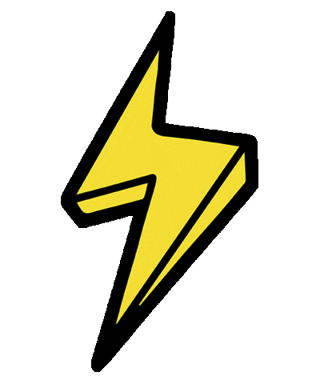

<h1 align="center">Welcome To Dat Tien Le Github</h1>
<h2 align="center"><i>A Passionate Programmer From Vietnam</i></h2>

####  Greetings! I’m Dat. You can call me Dylan. I am an IT student at the University of Transport Ho Chi Minh City.

####  I love talking about finance and technology. I'm trying to improve myself every day and developing sufficient skills to specialize in these fields and become a professional Software Engineer.

<h2 align="center">🔥 GitHub Stats 🔥</h2>

  

 

  

<h2 align="center">🤝 Connect with me 🤝</h2>

  
  
  
  

  

